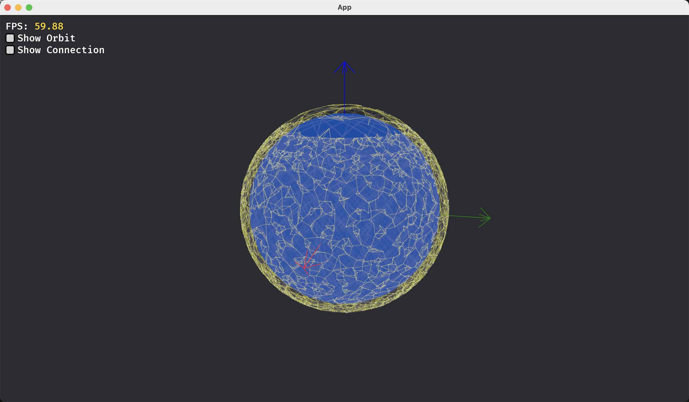

# Satellite Simulator


> Starlink satellites, connecting nearest.

## Project Overview
This simulator, built on the [Bevy engine](https://bevyengine.org/), offers a realistic simulation of low Earth orbit(LEO) satellites, simulating essential functions such as communication links, computation offloading, and energy consumption.

Designed to support research in satellite communication networks, it provides an intuitive 3D visualization that enables users to clearly observe satellite operations and communication pathways.

Users can access real-time simulation data through a network interface for further research and analysis.

## Features
- **Massive Satellite Simulation**: Supports simulating over 10,000 satellites at a frequency of 64 times per second
- **Orbital Mechanics**: Accurately simulates satellite orbits using imported JSON constellation data
- **Orbit Visualization**: Renders precise orbital paths in an interactive view
- **Camera Controls**: Features intuitive orbit camera with smooth rotation and zoom capabilities
- **Dynamic Communication Links**: Models real-time inter-satellite link (ISL) establishment and termination
- **Link Display**: Yellow lines show connections between satellites. Links break when satellites move too far apart
- **Network Interface**: Supports data retrieval through a network interface

## Installation

### Run from release:

1. Download the latest release from [here](https://github.com/LTstrange/satellite-simulator/releases):
   - Select and download the executable file compatible with your operating system
   - Download the `config.toml` configuration file and place it in the same directory as the executable
   - Download the `starlink.json` constellation data file and place it in the directory specified in the config file
   - If you plan to control the simulator via Python, download the Python example code included in the release
2. Run the executable file.


### Build from source code(recommended):

1. **Clone the Repository**

   Begin by cloning the repository:
   ```bash
   git clone https://github.com/LTstrange/satellite-simulator.git
   cd satellite-simulator
   ```
2. **Install the Rust Toolchain**

   If Rust is not yet installed, follow the official [installation guide](https://www.rust-lang.org/tools/install) to set up the Rust toolchain.
3. **Build the Project**

   Compile the project:
   ```bash
   cargo build --release
   ```
4. **Run the Simulator**

   Start the simulator by running:
   ```bash
   cargo run --release
   ```

## Usage

### Camera Controls
- **Windows**: Rotate view by dragging with left mouse button, zoom with mouse wheel
- **MacOS**: Rotate view with two-finger swipe, zoom with pinch gesture

### Configuration
The simulator's behavior can be customized through the `config.toml` file, which should be **placed alongside the executable**:
   - **[Dataset]**: Defines constellation data settings.
      - **constellation_file**: Specifies the relative path to the constellation dataset.
   - **[Network]**: Define network related attributes.
      - **port**: network control port
   - **[Display]**: Controls display-related settings.
      - **orbit**: Toggle orbit path display.
      - **connection**: Toggle ISL (Inter-Satellite Link) display.
   - **[Simulation]**: Configures simulation parameters.
      - **time_speed**: This multiplier adjusts the time slice size without causing simulation lag; however, setting it too high may reduce simulation accuracy.
      - **connection_distance**: Maximum inter-satellite link range
      - **connection_number**: Maximum connections per satellite

### Network Interface (Python Bindings in Progress) 🐍🛠️

I'm currently working on writing a Rust crate to communicate with this Bevy app over the network — and then wrapping it as a Python package for easier integration in research workflows.

However, learning how to properly use PyO3 and Maturin has proven to be more challenging than expected. I've already gone through multiple rewrites of this component, and more time is needed to finalize the implementation.

If you're familiar with building high-performance Python-Rust interfaces, contributions or advice would be greatly appreciated! 🙏✨

## Future Work
- **Enhanced Communication Link Modeling**: Add simulations for transmission delays and signal interference within established satellite links.
- **Computation Offloading Simulation**: Model the computational resources available on satellites.
- **Energy Simulation**: Implement energy modeling to account for power consumption due to transmissions and computations, along with solar energy recharging for satellites.
- **More Network Control**: Enable command input via a network interface to allow detailed adjustments, such as assigning computation tasks to specific satellites or configuring routing algorithms.
- For more information, please check [ROADMAP.md](./ROADMAP.md).

## Contributing
Solo development is challenging!
If you're interested in this project, please feel free to open an issue!
If you're proficient in Python or Rust, don't hesitate to reach out to me. I'd be happy to help you get familiar with the project!
